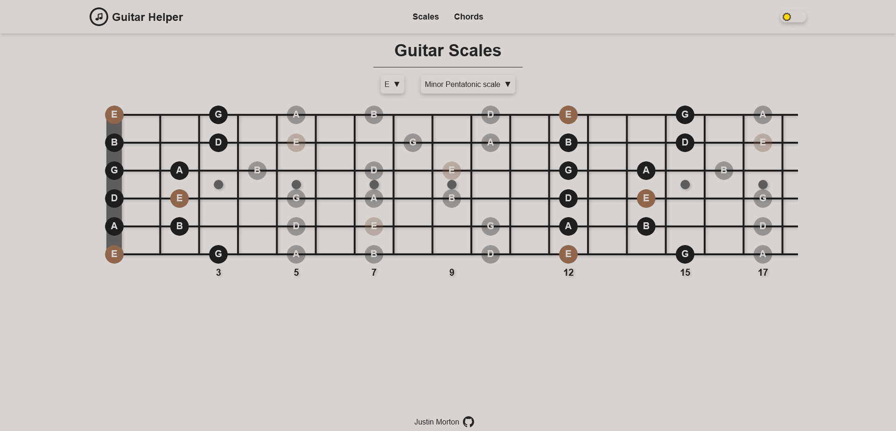
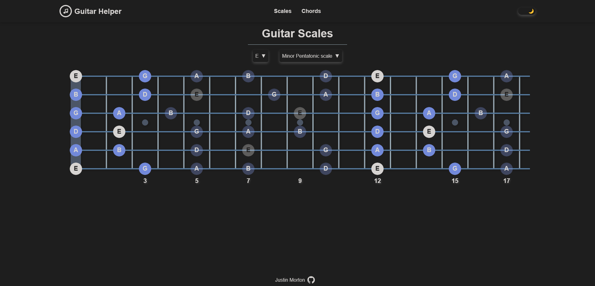

# Next.js Guitar Helper Web App by Justin Morton
## https://guitar-helper-jm.vercel.app/ 
A Next.js web app I developed to help with guitar practice. It currently supports a scales page where the user can select a key and a scale they want to practice and it will display to primary position on the fretboard. 

The following are some features I want to implement in the future.
- Ability to toggle extra positions.
- Ability to change the tuning of each string and/or popular alternate tunings.
- Chords page and support.
- Metronome on the scales page to help practice.
- Home page the ties together the rest of the app.
- Extra/custom themes.
- Mobile support.

## Home Page
### Light Mode

### Dark Mode


## Getting Started

First, run the development server:

```bash
npm run dev
# or
yarn dev
# or
pnpm dev
# or
bun dev
```

Open [http://localhost:3000](http://localhost:3000) with your browser to see the result.

You can start editing the page by modifying `app/page.tsx`. The page auto-updates as you edit the file.

This project uses [`next/font`](https://nextjs.org/docs/app/building-your-application/optimizing/fonts) to automatically optimize and load [Geist](https://vercel.com/font), a new font family for Vercel.
